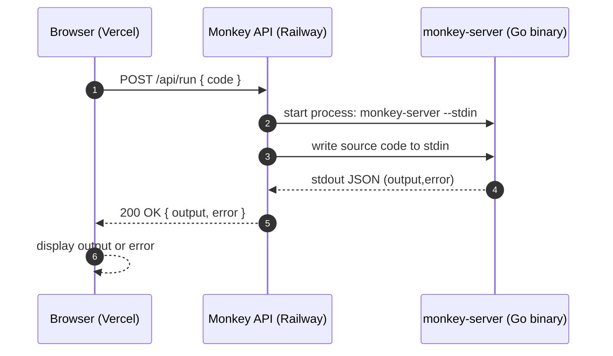
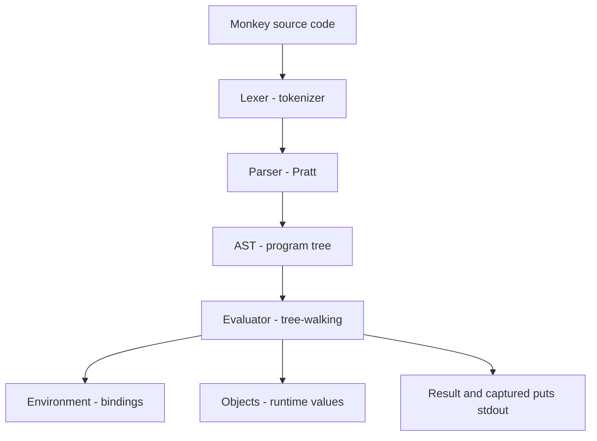

# Monkey Playground (Interpreter + API + Web UI)

**Try it live:** https://monkeyplayground.vercel.app/

This repository contains:

- A full **Monkey** interpreter written in **Go** (lexer → parser → AST → evaluator)
- A production-ready **HTTP API** (Spring Boot) that executes Monkey code safely by spawning the Go binary
- A **React + Vite** web playground UI

**Hosted:** Frontend on **Vercel**, backend on **Railway**.

## Overview

Monkey is a dynamically-typed programming language with C-like syntax. This project implements a complete interpreter pipeline — **Lexer → Parser (Pratt) → AST → Evaluator** — along with:

- a web playground (copy/paste code, run, see output/errors)
- an API layer that runs untrusted snippets with a hard timeout

## Architecture (How the Playground Works)

### High-level system diagram

```mermaid
flowchart LR
    U[User] -->|types Monkey code| FE[Frontend<br/>React + Vite<br/>(monkey-playground)<br/>Hosted on Vercel]
    FE -->|POST /api/run (code)| API[Backend API<br/>Spring Boot<br/>(monkey-api)<br/>Hosted on Railway]
    API -->|spawn: monkey-server --stdin| BIN[Interpreter binary<br/>Go<br/>(monkey-server)]
    BIN -->|stdout JSON (output,error)| API
    API -->|JSON response| FE
    FE -->|renders output/errors| U
```

### Request/response sequence



### Interpreter pipeline (inside the Go binary)



## Repo Components

- **Interpreter (Go):** the language implementation and CLI entrypoint.
- **`monkey-server` binary (Go):** built from the repo root; supports:
    - `--stdin`: read one program from stdin and print a single JSON object to stdout
    - `--server`: optional HTTP mode (`POST /run`) returning `{output,error}`
- **API (Java/Spring):** `POST /api/run` validates input, spawns the binary, enforces a timeout, and returns JSON.
- **Playground (React/Vite):** editor + examples + output panel; calls the API.

## Quickstart (Run the Web Playground Locally)

### 1) Run the backend API (Spring Boot)

The API spawns the Go binary (`monkey-server`) on each request.

```bash
# from repo root
go build -o monkey-server .

cd monkey-api

# point the API at the local binary (default is /app/monkey-server)
MONKEY_BINARY_PATH=../monkey-server ./mvnw spring-boot:run
```

The API starts on `http://localhost:8081` by default.

**Limits:** the API accepts up to 10,000 characters of source code per request and enforces a default 10s execution timeout.

### 2) Run the frontend (Vite)

```bash
cd monkey-playground
npm install
npm run dev
```

In dev mode the frontend calls `/api/run` and Vite proxies it to `http://localhost:8081`.

### Environment variables (deployment)

- **Frontend:** set `VITE_API_URL` to your backend base URL (the UI calls `${VITE_API_URL}/api/run` in production).
- **Backend:**
    - `PORT` (server port; Railway typically sets this)
    - `MONKEY_BINARY_PATH` (path to `monkey-server`)
    - `MONKEY_EXECUTION_TIMEOUT` (seconds; defaults to 10)

### Docker (backend)

The root `Dockerfile` produces a single container image that includes both the Spring Boot API and the `monkey-server` Go binary.

```bash
docker build -t monkey-backend .
docker run --rm -p 8080:8080 monkey-backend
```

## Features

- **Data Types**: Integers, Booleans, Strings, Arrays, Hash Maps
- **Variable Bindings** with `let` statements
- **Arithmetic & Comparison Expressions**
- **Prefix & Infix Operators**
- **Conditionals** (`if` / `else`)
- **First-Class Functions** & Closures
- **Higher-Order Functions**
- **Built-in Functions**: `len`, `first`, `last`, `rest`, `push`, `puts`
- **Array & Hash Map Literals** with index expressions
- **String Concatenation**
- **Error Handling** with descriptive messages
- **Interactive REPL**

---

## Getting Started (Interpreter CLI)

### Prerequisites

- Go 1.24.0 or later

### Installation

```bash
git clone <repository-url>
cd monkey
go build
```

### Run the REPL

```bash
go run main.go
```

```
Hello <username>! This is the Monkey programming language!
Feel free to type in commands
>> 
```

### Run Tests

```bash
go test ./...
```

---

## Language Guide

### Variables

Bind values with `let`. Statements end with a semicolon.

```javascript
let age = 25;
let name = "Monkey";
let pi = 3;
```

### Data Types

| Type | Example |
|---|---|
| **Integer** | `42`, `-7`, `0` |
| **Boolean** | `true`, `false` |
| **String** | `"hello world"` |
| **Array** | `[1, 2, 3]` |
| **Hash Map** | `{"key": "value", 1: true}` |
| **Function** | `fn(x) { x + 1 }` |
| **Null** | returned implicitly (e.g. out-of-bounds access) |

### Operators

#### Arithmetic

```javascript
>> 5 + 10
15
>> 10 - 3
7
>> 2 * 6
12
>> 10 / 2
5
```

#### Comparison

```javascript
>> 1 < 2
true
>> 3 > 5
false
>> 1 == 1
true
>> 1 != 2
true
```

#### Prefix

```javascript
>> -5
-5
>> !true
false
>> !false
true
```

#### String Concatenation

```javascript
>> "Hello" + " " + "World!"
Hello World!
```

### Conditionals

`if` / `else` are expressions — they return a value.

```javascript
let x = 10;

if (x > 5) {
    "big";
} else {
    "small";
}
// => "big"
```

You can use them inline:

```javascript
let max = fn(a, b) {
    if (a > b) { a } else { b }
};

>> max(3, 7)
7
```

### Functions

Functions are first-class values, created with `fn`. The last expression in the body is the implicit return value, or use `return` explicitly.

```javascript
let add = fn(a, b) { a + b };
>> add(2, 3)
5

let factorial = fn(n) {
    if (n == 0) {
        return 1;
    }
    n * factorial(n - 1);
};
>> factorial(5)
120
```

#### Closures

Functions capture their enclosing environment:

```javascript
let newAdder = fn(x) {
    fn(y) { x + y };
};

let addTwo = newAdder(2);
>> addTwo(3)
5
```

#### Higher-Order Functions

Pass functions as arguments or return them:

```javascript
let apply = fn(f, x) { f(x) };
let double = fn(x) { x * 2 };

>> apply(double, 5)
10
```

#### Immediately Invoked Functions

```javascript
>> fn(x) { x * x }(4)
16
```

### Arrays

Arrays are ordered, zero-indexed lists that can hold values of any type.

```javascript
let arr = [1, "two", true, fn(x) { x }];

>> arr[0]
1
>> arr[1]
two
>> arr[3](42)
42
```

Out-of-bounds access returns `null`:

```javascript
>> [1, 2, 3][99]
null
>> [1, 2, 3][-1]
null
```

### Hash Maps

Hash maps are key-value collections. Keys can be strings, integers, or booleans.

```javascript
let people = {"name": "Monkey", "age": 1, true: "yes"};

>> people["name"]
Monkey
>> people["age"]
1
>> people[true]
yes
```

Missing keys return `null`:

```javascript
>> {}["missing"]
null
```

Use expressions as keys and values:

```javascript
let key = "name";
let data = {key: "Monkey", "score": 10 * 5};

>> data["name"]
Monkey
>> data["score"]
50
```

### Built-in Functions

#### `len(arg)`

Returns the length of a string or array.

```javascript
>> len("hello")
5
>> len([1, 2, 3])
3
>> len("")
0
>> len([])
0
```

Errors on unsupported types:

```javascript
>> len(1)
ERROR: argument to `len` not supported, got INTEGER
>> len("a", "b")
ERROR: wrong number of arguments. got=2, want=1
```

#### `first(arr)`

Returns the first element of an array, or `null` if empty.

```javascript
>> first([10, 20, 30])
10
>> first([])
null
```

#### `last(arr)`

Returns the last element of an array, or `null` if empty.

```javascript
>> last([10, 20, 30])
30
>> last([])
null
```

#### `rest(arr)`

Returns a **new** array with the first element removed, or `null` if empty.

```javascript
>> rest([1, 2, 3])
[2, 3]
>> rest([1])
[]
>> rest([])
null
```

#### `push(arr, value)`

Returns a **new** array with the value appended. Does **not** mutate the original.

```javascript
>> let a = [1, 2];
>> let b = push(a, 3);
>> b
[1, 2, 3]
>> a
[1, 2]
```

#### `puts(args...)`

Prints each argument on a new line. Returns `null`.

```javascript
>> puts("Hello", "World")
Hello
World
null
```

### Loops (via Recursion)

Monkey has no `for` or `while` keywords. Loops are expressed through **recursive functions**, which is natural since Monkey supports closures and tail calls.

#### Counting

```javascript
let countdown = fn(n) {
    if (n < 1) {
        return 0;
    }
    puts(n);
    countdown(n - 1);
};

>> countdown(3)
3
2
1
```

#### Iterating Over an Array

Use `first`, `rest`, and recursion:

```javascript
let forEach = fn(arr, f) {
    if (len(arr) > 0) {
        f(first(arr));
        forEach(rest(arr), f);
    }
};

>> forEach([1, 2, 3], fn(x) { puts(x * 2) })
2
4
6
```

#### Map (Transform Each Element)

```javascript
let map = fn(arr, f) {
    let iter = fn(arr, acc) {
        if (len(arr) == 0) {
            return acc;
        }
        iter(rest(arr), push(acc, f(first(arr))));
    };
    iter(arr, []);
};

>> map([1, 2, 3], fn(x) { x * x })
[1, 4, 9]
```

#### Reduce / Fold

```javascript
let reduce = fn(arr, initial, f) {
    if (len(arr) == 0) {
        return initial;
    }
    reduce(rest(arr), f(initial, first(arr)), f);
};

let sum = fn(arr) {
    reduce(arr, 0, fn(acc, el) { acc + el });
};

>> sum([1, 2, 3, 4, 5])
15
```

#### Filter

```javascript
let filter = fn(arr, pred) {
    let iter = fn(arr, acc) {
        if (len(arr) == 0) {
            return acc;
        }
        if (pred(first(arr))) {
            iter(rest(arr), push(acc, first(arr)));
        } else {
            iter(rest(arr), acc);
        }
    };
    iter(arr, []);
};

>> filter([1, 2, 3, 4, 5], fn(x) { x > 2 })
[3, 4, 5]
```

---

## Complete Example

A program that computes the sum of squares from an array:

```javascript
let numbers = [1, 2, 3, 4, 5];

let reduce = fn(arr, initial, f) {
    if (len(arr) == 0) {
        return initial;
    }
    reduce(rest(arr), f(initial, first(arr)), f);
};

let result = reduce(numbers, 0, fn(acc, n) { acc + n * n });

>> result
55
```

---

## Project Structure

```
monkey/
├── ast/             # Abstract Syntax Tree node definitions
│   ├── ast.go
│   └── ast_test.go
├── evaluator/       # Tree-walking evaluator
│   ├── evaluator.go
│   ├── builtins.go
│   └── evaluator_test.go
├── lexer/           # Lexical analyzer (tokenizer)
│   ├── lexer.go
│   └── lexer_test.go
├── object/          # Internal object system (values at runtime)
│   ├── object.go
│   └── environment.go
├── parser/          # Pratt parser (recursive descent)
│   ├── parser.go
│   ├── parser_tracing.go
│   └── parser_test.go
├── repl/            # Read-Eval-Print Loop
│   └── repl.go
├── token/           # Token type definitions
│   └── token.go
├── main.go          # Entry point
├── go.mod
└── README.md
```

## Token Types

| Category | Tokens |
|---|---|
| **Literals** | `IDENT`, `INT`, `STRING` |
| **Operators** | `+`, `-`, `*`, `/`, `=`, `!`, `<`, `>`, `==`, `!=` |
| **Delimiters** | `(`, `)`, `{`, `}`, `[`, `]`, `,`, `;`, `:` |
| **Keywords** | `let`, `fn`, `if`, `else`, `return`, `true`, `false` |
| **Special** | `EOF`, `ILLEGAL` |

---

**Note**: This is a learning project implementing a tree-walking interpreter. The Monkey language is designed for educational purposes to understand lexing, parsing (Pratt parsing), ASTs, and evaluation.
